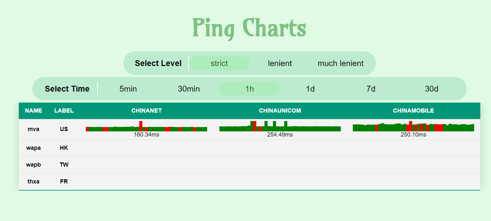
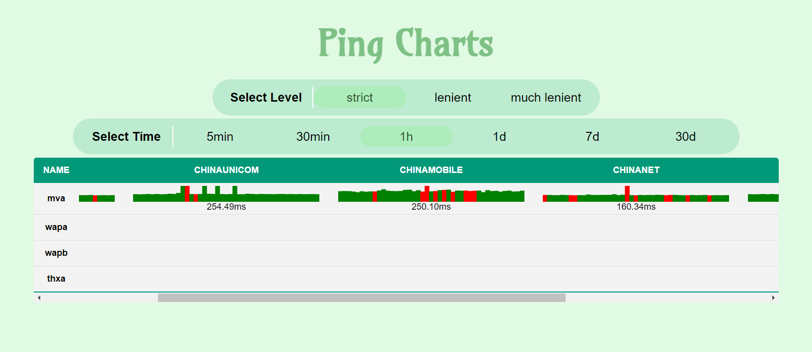

# Ping Charts


A simple tool to visualize delays of VPS using Python Flask and Vue.

## Screenshots

<details>
<summary>General</summary>

</details>

<details>
<summary>Scroll</summary>

</details>

## Usage

For those who do not care about the code and just want to simply run this project, see [setup](./doc/setup.md).

For Chinese users: [一键脚本使用说明](./doc/setup-zh.md).

### Configuration

See [here](./doc/configuration.md).

For Chinese users: [配置说明](./doc/configuration-zh.md).

### Using compiled executable file

**Work fine under Debian, donot test other OS**

Just prepare the configuration files and download the executable file from [releases](https://github.com/ping-charts/ping-charts/releases) page, then execute it.

Run `ping-charts-client --help` and `ping-charts-server --help` to see available CLI options.

### Using source code

**Server && Client**

- Install dependencies in "requirements.ext" under client/ and server/.
- Prepare the configuration file (both server side and client side).
- Run the command `python ping-charts-client.py --help` or `python ping-charts-server.py --help`.

**Web-UI**

The web static files have been packed into 'static/' and 'templates/' under 'server/src/'. You do not need to run the Web-UI separately in general.

Only when you want to change the UI elements (which means you will directly change the source code), you should run the web-ui using Node.js.

Add the 'dev' environment variable to tell Vue to use the development mode.

```shell
npm install
export dev='dev' # see vue.config.js
npm run serve
```

### Nginx sub-location

If you want to use the project under Nginx as a 'sub-location', you can refer to the following configuration.

Make sure you understand what you are doing when making any changes.

```
# ping charts
location /ping/ {
    proxy_redirect off;
    proxy_pass http://127.0.0.1:5555; // server port
    proxy_http_version 1.1;
    proxy_set_header X-Forwarded-For $proxy_add_x_forwarded_for;
    proxy_set_header X-Forwarded-Proto $scheme;
    proxy_set_header X-Forwarded-Host $host;
    proxy_set_header X-Forwarded-Prefix /ping; // same as the location set above
    rewrite ^/ping/(.*) /$1 break;   // watch out
}
```

## Dev

PRs are welcomed.

**TODO**

I want to keep implementing these functions if many people need.

- [ ] Delete old data (see test/../delete_old_data.py)
- [ ] Auto manage clientId and targetId
- [ ] Scroll table border radius

## Thanks

- [Title style comes from here](https://codepen.io/jakestuts/pen/AEMqEM)
- [Table style](https://dcode.domenade.com/tutorials/how-to-style-html-tables-with-css)
- [Fixed column table](https://stackoverflow.com/questions/15811653/table-with-fixed-header-and-fixed-column-on-pure-css)
